# TrainVerify：从真实分布式训练图到 Lean 内核定理

> 一份以 YOCO-MoE-A0.4B 为主线的形式化工程全流程说明
>
> 文档状态：2026-08-10；五个full theorem的核心证明基线为 `7b019aceaf65af957d4af737c98c7057b884bf9c`，release registry/emitter状态以本文所在exact tree为准。

## 0. 先说结论

TrainVerify 不是“给神经网络跑几个数值样例，看看单卡和多卡结果是否接近”的测试框架。它试图把下面这件事变成一个可以由 Lean 内核检查的数学命题：

> 对固定来源、固定版本、固定并行策略生成的单设备图（single-model graph，SM）和分布式图（parallel-model graph，PM），在明确列出的输入条件下，PM 各 rank 的张量经过复制、分片、通信、shuffle、unshuffle、专家路由和重构后，与 SM 中对应的全局张量满足正确的值关系。

“正确的值关系”不总是简单相等。它可能是：

- rank 0 与 rank 1 的连续分片拼回 SM 张量；
- 两个 rank 持有同一个复制值；
- 两个 rank 按 context-parallel zigzag 顺序持有 SM 序列；
- 每个 rank 持有不同专家或不同 hidden slice，经 AllToAll / AllGather 后重构；
- Q 属于 zigzag 布局，而 K/V 仍是 shuffle 前投影产生的普通连续分片；
- 最终观测值是 loss、z-loss、24 层 routing-map stack、expert-prob stack，或 hidden-sharded embedding 的通信结果。

YOCO-MoE-A0.4B 是目前规模最大、语义最复杂的回归样本。对当前仓库中 checked-in generated graph，public proof surface 导出五个完整 statement：

```lean
goal_1_stmt_full
goal_2_stmt_full
goal_3_stmt_full
goal_4_stmt_full
goal_5_stmt_full
```

`Instances.lean` 的导出层字面签名是：

```lean
theorem prove_goal_1_from_pattern_1 : goal_1_stmt_full
theorem prove_goal_2_from_pattern_2 : goal_2_stmt_full
theorem prove_goal_3_from_pattern_3 : goal_3_stmt_full
theorem prove_goal_4_from_pattern_4 : goal_4_stmt_full
theorem prove_goal_5_from_pattern_5 : goal_5_stmt_full
```

它们由 `MainTheorem.FullPatternTier` 合取。五项均经过独立 exact-tree 审计和 `#print axioms` 审计，没有 `sorryAx`，没有项目手写 axiom；外部 caller contracts 也由汇总定理 `FivePublicContractsJointWitness` 分别给出具体可满足性见证。

不过，**Lean证明完成不等于正式快照已经发布**。真实双GPU live-profile重跑已经证明planner会因fresh computation profile选择不同PM图，并在raw digest gate fail closed；对authenticated canonical profile的只读重放则确认现有proof绑定canonical graph。当前registry已把raw fresh emission与五个Goal proof overlays分层，但修复本身改变了TrainVerify exact revision，因此仍需从最终owner-private commit重新生成authority并完成clean-room Lean/axiom/ledger/no-replace publication。本文严格区分“对checked-in statements的证明完成”“raw authority绑定”和“sealed snapshot发布”。

```mermaid
flowchart LR
  A[llm-train 模型源码] --> B[nnScaler trace / AutoDist]
  B --> C[双 GPU 双 rank authority]
  C --> D[SM / PM 图与 provenance]
  D --> E[graph-to-Lean 规格]
  E --> F[faithful Denote 与分布关系]
  F --> G[局部定理与 ancestry certificate]
  G --> H[五个 goal_N_stmt_full]
  H --> I[Lean kernel / axioms / non-vacuity 审计]
  I --> J[closed proof registry]
  J --> K[sealed no-replace snapshot]
```



---

## 1. 为什么需要 TrainVerify

### 1.1 分布式训练的正确性问题不是 shape 问题

把一个模型从单卡改写为多卡，通常会引入：

- tensor parallel / expert parallel / context parallel；
- rank-local shard；
- AllReduce、AllGather、ReduceScatter、AllToAll；
- 为 ring attention 设计的序列重排；
- replicated weights、expert-local weights、buddy ranks；
- 编译器自动插入的 adapter 和 collective；
- 训练框架、图编译器、runtime kernel 之间的 annotation contract。

许多错误不会破坏 shape。两个 `[2048, 1024]` 的张量可以拥有完全相同的 shape，却分别对应：

1. 全局序列前半段；
2. 全局序列的 zigzag 行集合；
3. 另一 rank 的复制副本；
4. 某个专家集合的局部结果；
5. 经过错误 rank-order concat 得到的排列错误值。

因此，下列检查都不够：

- 图可生成；
- kernel 可运行；
- shape 全部一致；
- 单个随机输入数值“看起来差不多”；
- Python checker 通过；
- Lean 文件能编译，但证明的是被弱化或切断的 statement；
- theorem 无 `sorry`，但依赖了不一致 axiom；
- public theorem 名称正确，实际却指向旧 cut graph。

TrainVerify 要求每条跨 rank 值关系都显式进入规格、证明和审计链。

### 1.2 项目目标：proof compiler

理想中的 TrainVerify 是一个 proof compiler。输入应当只有：

- SM authority graph；
- PM authority graph；
- 固定源码 revision 和 provenance；
- 已安装的算子语义库；
- 已安装的分布关系定理库；
- 独立可检查的输入 well-formedness contract。

输出必须二选一：

1. 生成完整 proof-certificate DAG，并由 Lean 内核验证；
2. fail closed，定位第一个 unsupported operator、missing relation rule、missing input contract、ambiguous authority、false goal、certificate bug 或 trust failure。

YOCO 证明了这条路线可以扩展到真实 Transformer/MoE/CP 图，但尚未达到“任意新网络一键完成”的程度。当前仍有大量 YOCO 专用 ancestry、TID reduction 和组合模块。这个限制不能藏在“1154/1156 coverage”或“五个 theorem 已绿”后面；详见第 19 节。

---

## 2. TrainVerify 究竟形式化了什么

### 2.1 图，不是 PyTorch 程序文本

TrainVerify 的直接对象是 nnScaler 编译得到的图。抽象上，一个图包含：

- 有序节点列表；
- 每个节点的 operator、input TID、output TID、参数；
- rank 数和 replica group；
- tensor shape；
- 初始化输入和目标观测；
- 与源码 revision、pickle、metadata 对应的 provenance。

Lean 侧以 `GraphDecl`、节点和 store 语义承载这些信息。图执行不是调用 PyTorch，而是对一个纯 `Store` 做 fold：

```text
Store = TensorId → Tensor

denoteGraph graph initStore targetTid
  = 从 initStore 开始，按节点顺序解释并写回 Store，最后读取 targetTid
```

对于需要观察 replica-buddy 或 collective 结构的图，最终证明使用 `denoteGraphDistributedFaithful`，而不是普通 `denoteGraph`。后者无法忠实表达某些跨 rank 值依赖。

### 2.2 张量语义

Lean 中的 tensor 不是“只记录 shape 的幽灵值”。算子定理必须说明输出值如何由输入值产生。项目为 embedding、linear、RMSNorm、activation、reshape/view、stack、loss、top-k、MoE grouped GEMM、collective、shuffle/unshuffle、attention 等建立了 denotation 和局部组合定理。

当然，形式化不会宣称覆盖 CUDA kernel 的每个浮点舍入细节。它验证的是项目定义的抽象 tensor semantics 下，SM/PM 图之间的分布式值关系。这个抽象边界必须在报告中公开，不能把“抽象语义等价”写成“任意硬件 bitwise 等价”。

### 2.3 三类关键关系

#### 普通连续分片：`Gather2Rel` / `Ordinary2Rel`

若 SM 张量沿某维被连续分成两块，PM rank 0/1 各持一块，关系表达为：

```text
SM = concat(PM_rank0, PM_rank1, dim)
```

它适用于普通 dim-0/dim-1 shard、部分 embedding / hidden shard，以及 shuffle 前的 K/V cache shard。

#### Zigzag 布局：`Zigzag2Rel`

context parallel 的 `maybe_shuffle` 不是普通切半。以 cp=2 为例，每个 rank 持有首尾交错的 sequence chunks。`Zigzag2Rel` 同时记录：

- SM 全局 tensor；
- PM 两个 rank-local tensor；
- packed `cu_seqlens`；
- full shape 和 rank-local shape；
- zigzag 的重构次序。

这使得“同 shape、不同 ownership”的差异进入 theorem type，而不是藏在注释中。

#### 复制与 replica-buddy 关系

MoE 图中不能因为两个 rank 上的 TID 或 operator 名相似，就假设值相等。复制事实必须来自：

- 共同 source / ancestry；
- 明确 collective；
- replica-buddy metadata；
- 可检查的 graph certificate。

这条规则曾阻止一个很诱人的错误捷径：把 expert 或 cache 输入仅凭“看起来对应”当作 replicated。形式证明要求展示值 provenance。

### 2.4 statement 形式化的不只是结论

一个完整 `goal_N_stmt_full` 通常量化：

```lean
∀ initSM initPM,
  StoreShapesHold ... →
  InitGoalsHold ... →
  InputValueClassesHold ... →
  PackedCuSeqlensWF ... →
  LabelBounds ... →
  最终 SM/PM 关系
```

caller 可以提供的只有独立可检查输入事实，例如：

- canonical shape environment；
- SM/PM init goals；
- 同一输入 metadata 的 value classes；
- packed `cu_seqlens = [0, 4096]` 且 cp size 为 2；
- label 小于 vocabulary size。

caller **不能**被要求提供：

- 某个中间 cache 已满足 `Gather2Rel`；
- L23 stream 已满足 `Zigzag2Rel`；
- 某个 loss gather 已经相等；
- 某段 faithful ancestry 的输出关系；
- 任意由图计算产生的中间 tensor equality。

否则 theorem 只是把需要证明的结论换了个名字塞进 premise。

---

## 3. llm-train、nnScaler、TrainVerify 的边界

三者的职责不能混写。

| 层 | 作用 | TrainVerify 如何使用 |
|---|---|---|
| llm-train | 定义 YOCO 模型、算子调用和训练逻辑 | 固定 revision，作为被编译程序与源码语义依据 |
| nnScaler | trace、并行规划、adapter/collective 插入、runtime | 产生 SM/PM 图和分布 metadata |
| TrainVerify | authority 固化、图到 Lean、Denote、证明、审计、发布 | 检查 nnScaler 生成图是否满足声明的 SM/PM 关系 |

TrainVerify 不应偷偷“修正”authority 图。若图里插入了一个值语义错误的 collective，正确结果是：

1. 保留该图；
2. 形式化真实 collective 语义；
3. 得到 false goal 或反例；
4. 定位是模型调用、annotation、compiler adapter 还是 Denote 的问题；
5. 修上游后重新生成 authority。

直接在 Lean 里把 shuffle 定义为 identity，或者把错误 gather 改写成正确 unshuffle-gather，只会证明一个不存在的程序。

---

## 4. 从真实训练代码建立 authority

### 4.1 固定源码 revision

当前 production authority 使用：

```text
llm-train:
  9a1be1d5fd1c063d80be82797692cdc7d23cfbef

nnScaler:
  d3d468ed23edb2f28aa8566b2dfb6ed49c5955cf
```

nnScaler 使用的是支持 llm-train 显式 CP/EP API 的 companion revision；审计时的 `main` 不接受 `cp_size` 和 `require_full_plan_sequence_partition` 参数，因此不能随意换成 main 再沿用旧证明。

源码不是从开发 worktree 直接执行，而是 materialize 为 owner-only、no-hardlink、fixed-commit private clone。这样源码路径、Git blob 和运行时字节能够绑定。

### 4.2 为什么 CPU smoke 不是 authority

CPU smoke 可以检查：

- import；
- tracing；
- code generation；
- pickle extraction；
- shuffle/unshuffle wiring 是否出现。

但它使用缩小模型和 deterministic policy，metadata 明确写 `"authority": false`。它不能证明 production planner 在两张 GPU 上选择了同一图，也不能证明真实 NCCL/process group、GPU profile 和硬件 selector 路径。

### 4.3 为什么必须双 GPU、双 rank NCCL

仅设置 `plan_ngpus=2` 不够。production authority 要求：

```text
PM plan_ngpus    = 2
PM runtime_ngpus = 2
```

原因有四个：

1. `maybe_shuffle` 是否真正执行，取决于 process group 是否包含多个设备；
2. NCCL collective 路径与 CPU/Gloo 或单进程模拟不同；
3. nnScaler AutoDist 会消费 GPU 通信和算子 profile，图选择依赖这些成本；
4. rank-local dump receipt 必须证明两个 worker 实际启动并参与。

因此，CPU、单 GPU、只改 planner 参数、手写 PM graph，都不构成 production authority。

### 4.4 当前硬件 authority

冻结的 authority 来自两张：

```text
NVIDIA RTX PRO 6000 Blackwell Workstation Edition
compute capability: 12.0
memory: 101,973,491,712 bytes / GPU
CUDA runtime: 12.8
NCCL: 2.27.3
NVIDIA driver: 595.71.05
```

关键元数据：

```text
model: YOCO-MoE-A0.4B
layers: 24
cross_layers: 12
max_seq_len: 4096
hardware_sha256:
  613b4c06c2aae12f552860845db71aaacb87d5f174812e3d1cdc677be83746a6
comm_profile_sha256:
  b25bef1b70b9b0539fde3264c760c4416562e5b2576df6596ef1db06d60d3b34
comp_profile_sha256:
  53a7e4e3f75e71b7e40b41f8508b8df33ae12cc246191951182a77d56b5ec30d
raw SM pickle SHA-256:
  333a14387e13cb265e74588f02133a0c47b02329d3d1811e6d7a736387494f64
raw PM pickle SHA-256:
  a47d033c83a0cd6dff9111ba49071f3a80eb60869435fc2adeb4f725a71c3462
```

历史 canonical authority 的 content ledger 为：

```text
e7690bf9b5948741e05689c5f5e3738641251b4335f1eb1219b32c91f0e0b234
```

authority 原始图规模为 SM 2074 nodes、PM 4363 nodes。历史 authority 做过两次独立重现，SM/PM raw pickle 分别回到上面列出的同一 SHA-256。证明生成会做 backward slice、目标拆分和去重，因此 proof graph 的 node 数可以更小；不能把 slice 规模误写成 runtime authority 图规模。

### 4.5 数值证据定位

下表中的 authority 路径都相对于 owner-only canonical authority 目录；proof 路径相对于 TrainVerify proof baseline `7b019ace…`。

| 文中事实 | revision-scoped evidence |
|---|---|
| upstream revisions、GPU inventory、CUDA/NCCL/driver、hardware digest | `gen_args.json` 的 `llm_train_commit`、`nnscaler_commit`、`gpu_inventory`、版本和 `hardware_sha256` 字段 |
| SM/PM node counts `2074/4363` | `sm_provenance.json.node_count`、`pm_provenance.json.node_count`；`gen_args.json` 的 `sm.node_count` / `pm.node_count` |
| raw pickle hashes | 对 `sm_mgener.pkl` / `pm_mgener.pkl` 实际字节计算 SHA-256，并与 provenance/receipts 比较 |
| comm/comp profile hashes | `gen_args.json.comm_profile_sha256`、`gen_args.json.comp_profile_sha256`；对应 profile artifact 实际字节 |
| native solver和patched sources | `gen_args.json`、rank receipts、authority 内 `nnscaler_dp_solver.so` 及 patched-source hash fields |
| registry `455` modules 与五 targets | `scripts/yoco_regen/yoco_proof_registry.json`，以及第 17.1 节的 source-hash command |
| Goal 4 `58` files | registry 中 basename 匹配 `Goal4PublicFaithful*.lean` 的唯一集合，其中包含 public entry |
| `51/108` tests | 第 17.1 节列出的两条实际 pytest 命令与本文编写时输出 |

历史两次重现的完整执行日志未全部作为当前 public tree 的文件发布，因此本文只把 canonical artifact 的现存 hashes 作为可独立复核事实，不据此声称保存了完整 run transcript。

---

## 5. authority 的运行时供应链为什么这么重

形式证明只可信到其输入。若 authority 生成过程能被可变 site-packages、`.pth`、替换后的 native extension 或路径竞争劫持，那么 Lean 最终只是在认真证明一份来历不明的图。

production generator 因而采取了近似发布系统的防护。

### 5.1 sealed Python runtime

- 固定 nnScaler archive、patched `parallel.py`、startup guard 打包为 deterministic ZIP；
- ZIP 放入 fully sealed memfd；
- controller 和 worker 都使用 Python `-S`；
- 通过 `/proc/<holder>/fd/*` 读取，holder 存活期间不可替换；
- `sitecustomize` guard 重查 seal 和 hash；
- extension finder 只接受精确模块名和精确路径；
- 任一检查失败直接 `os._exit(126)`。

### 5.2 sealed native solver

nnScaler DP solver 不运行 upstream `setup.py`。系统从 fixed-commit archive 读取有限构建输入，用固定 compiler/linker/objcopy 命令生成 ELF，并：

- 检查 source/header/assembly bytes；
- 去除 build-id 和非 runtime symbol metadata；
- 恢复 canonical source `FILE` symbol；
- 要求 byte-for-byte canonical digest；
- 以 sealed memfd 提供给 runtime。

canonical authority 中实际消费的 DP solver ELF SHA-256 为：

```text
e9b3072d6704f81db49726ba1c30da493a6793b388b8afe32dd26d1f6343debe
```

### 5.3 sealed communication / computation profiles

通信 profile 来自真实双 GPU：

```bash
torchrun --standalone --nproc_per_node=2 \
  -m nnscaler.profiler.benchmark_comm
```

缺 profile 时 fail，不允许用 MI200 fallback。

算子 computation profile 则先 warmup 收集所有具体 operator shape，再打成 canonical `comp_profile.json`。正式 SM 和 PM compile 使用同一 sealed profile，且禁止 runtime 再测量或修改缓存。这样 planner cost 进入 provenance，而不是成为不可复现的环境噪声。

### 5.4 no-replace publication

生成、验证和发布在同一 dirfd-bound 流程中完成：

- staging parent 及祖先必须由 root/current user 控制；
- 禁止 group/world writable；
- 拒绝 symlink、special file、foreign inode、额外缓存；
- exact allowlist；
- validation 后只能 forward rename 到新路径；
- 失败后禁止 pathname rollback；
- 目标路径已存在则失败，不覆盖。

这不是“安全装饰”。它保证 authority、proof registry 和 Lean snapshot 可以被 content address 唯一指认。

---

## 6. 图生成：从 pickle 到 Lean declaration

### 6.1 输入检查

emitter 在 unpickle 前检查：

- ownership 和权限；
- authority flag；
- llm-train / nnScaler / TrainVerify revision；
- SM/PM policy 和 topology；
- pickle hash 与 rank-0 receipt；
- hardware / comm / comp profile digest；
- metadata closed schema。

pickle 是 executable input，所以只有本地产生且通过 out-of-band hardware digest 核验的 authority 才能用 `--trust-new-authority` 接受。

### 6.2 graph-to-Lean 产物

生成器输出：

- 主图 declaration；
- 分拆的 `Goal_N.lean`；
- shape environment；
- init goals；
- input value classes；
- intermediate goals；
- observable top-level goals；
- provenance manifest；
- path-to-SHA-256 ledger。

数值 TID、node index、goal slice 必须从新图重新生成。禁止拿旧 snapshot 的 TID 做 bulk replacement。

### 6.3 backward ancestry closure

早期 cut proof 的典型缺陷，是把图计算得到的中间 tensor 当成 `initStore` 输入。例如旧 Goal 4 曾在后 12 层入口处切断，却没有为这些值增加 lineage premise。改变一个中间 tensor、保持 shape 和 input metadata 不变，就可能改变最终 routing stack；statement 因而过弱。

当前 generator 对含 replica/shuffle-aware collective 的目标做 SM/PM 双侧 backward closure，直到只剩 genuine authority inputs。若一个 graph-computed read 被暴露为 unconstrained boundary，生成门禁直接失败。

---

## 7. faithful distributed denotation

### 7.1 为什么普通 evaluator 不够

普通 `denoteGraph` 逐 rank 看 local store。某些 collective 的真实输出依赖：

- 另一 rank 的 tensor value；
- replica group；
- buddy rank；
- shuffle permutation；
- process-group scope。

若 evaluator 看不到这些信息，把 op 解释成 identity 可能保持 shape，却丢掉关键值语义。项目保留过 shape-correct、value-lossy 的 legacy/ring evaluator，用于历史兼容或诊断；它不能计入 faithful public theorem。

### 7.2 `denoteGraphDistributedFaithful`

faithful evaluator 的 dispatch 由完整 ancestry、真实 node、operator 和 replica-buddy 结构驱动。禁止：

- 按 Goal number 切换语义；
- 看到某个 TID 就特殊处理；
- 因 operator 名相同就假设两个 rank 值相等；
- 把 shuffle/unshuffle 当 identity；
- 对含 replica collective 的最终 ancestry 使用普通 evaluator。

### 7.3 shuffle / unshuffle

`FW_maybe_shuffle` 在 cp size 1 时 early return；在 cp size 2 且 process group 有两个设备时，真实执行 all-to-all permutation。因此形式化需要同时区分：

- op 是否存在；
- cp size；
- input partition dimension；
- process group 是否为 `None`；
- packed `cu_seqlens` 是否 well formed。

仅检测图中出现 `maybe_shuffle` 会误判单设备图；仅看 shape 则会漏掉多设备排列。

### 7.4 replica-buddy MoE

YOCO 的 MoE 路由跨 expert/rank。证明链覆盖：

- router logits；
- top-k indices / scores；
- dispatch mask / probability；
- remote expert 输入；
- grouped GEMM 的 up/gate/down；
- activation；
- AllToAll；
- residual / output merge。

局部定理把 operator semantics 与 ownership relation组合起来，再由 layer certificate 串成 24 层 ancestry。任何“buddy 值相等”都必须有 provenance certificate。

### 7.5 CP sliding-window 与 mixed attention

YOCO 后 12 层的 attention 是最容易证明错的部分。最终语义不是“所有东西都 zigzag”，而是 mixed layout：

```text
Q / decoder stream:
  post-shuffle Zigzag2Rel

K/V cache:
  pre-shuffle projection产生的 ordinary contiguous shards
  使用 Gather2Rel
```

attention relation因此必须同时消费：

- zigzag Q；
- rank-local ordinary K shard；
- rank-local ordinary V shard；
- packed CU metadata；
- graph 中真实的 3D→2D reshape；
- sliding-window / sharded-KV operator semantics。

把 K/V 当 replicated 或 zigzag，都能写出“类型看起来合理”的错误 lemma，但与真实图不符。

---

## 8. K/V provenance 调查：一次必须公开的撤回

这段历史很重要，因为它说明形式化工程不是“总能第一次猜对”，而是如何纠正自己的假设。

### 8.1 最初的错误判断

看到 decoder stream 在 `maybe_shuffle` 后保持 zigzag，早期分析曾推断 cache K/V 也由 zigzag-owned hidden state 投影得到。沿这个假设，一度怀疑 llm-train/nnScaler 在 K/V ownership 上存在上游漏洞，并产生了候选修复提交。

这些候选提交最终**不进入 authority，也不能作为上游 bug 证据**。

### 8.2 回到源码执行顺序

对 `llm-train@9a1be1…:llm/arch/model.py` 的数据流重新审计后发现：

1. K/V projection 发生在 `wrap_maybe_shuffle(h)` 之前；
2. cache K/V 来自 pre-shuffle ordinary contiguous hidden shards；
3. shuffle 后的是 Q / decoder residual stream；
4. 因此 PM 两 rank 的 K/V 是不同 ordinary shards，不是同值副本，也不是 zigzag shards。

最终证明采用：

```text
cache boundary: 5595 ↔ 9722 / 9723  via Gather2Rel
L22 K:          6202 ↔ 11466 / 11467 via Gather2Rel
L22 V:          6203 ↔ 11472 / 11473 via Gather2Rel
L22 Q:          6201 ↔ 11454 / 11455 via Zigzag2Rel
```

### 8.3 方法论结论

- TID 对应不等于值 provenance；
- “位于 shuffle window 中”不等于“由 shuffled value 计算”；
- 必须沿 producer edge 回溯到 projection 的真实位置；
- 错误假设即使能在 Lean 中闭合，也必须撤回；
- 文档必须保留撤回记录，不能把它包装成“TrainVerify 发现 llm-train bug”。

### 8.4 明确排除的候选 revision

以下候选修复建立在已经撤回的“cache K/V 为 zigzag-owned”假设上，不属于 reviewed authority，也不得进入发布 provenance：

```text
llm-train:
  00a87a3
  0aa5c6e

nnScaler:
  5405fe8540cabe6a455025eb61eb316293eaf75e
  c9330a5
  a8198bd3d908eecc2c249fb174d53b1865290e4c
```

列出它们不是为了暗示这些 commit 已被证明“代码错误”，而是为了防止未来从实验分支中误选 revision。production authority 只接受第 4.1 节列出的固定 revisions。

---

## 9. 问题发现与归因

这里按责任层分类，避免把所有失败都叫“llm-train bug”。

| 判断 | 状态 | 可以写到结论里的措辞 |
|---|---|---|
| CC12 grouped-GEMM selector 不兼容 production hardware | 已由真实双 GPU authority run 确认 | llm-train runtime/hardware selector 兼容问题 |
| post-shuffle zigzag shard 被普通 rank-order gather | 源码、图和 two-process reproduction 确认 | nnScaler RVD/annotation/adapter integration 缺口 |
| cache K/V 是 zigzag-owned | 已被源码执行顺序证伪 | 撤回，不得作为 bug |
| balance-loss mask 与 routing map 错位 | 超出当时 trace scope，已撤回 | 不得声称 llm-train 语义 bug |
| 五个最终 public statement | Lean exact-tree 与 axiom audit 通过 | 在当前抽象 Denote 语义下已证明 |
| 最终 sealed snapshot | authority 与 checked-in generated provenance 尚未闭合 | blocked，不得声称已发布 |

### 9.1 已确认：llm-train 的 CC12 grouped-GEMM selector 兼容性问题

在 RTX PRO 6000 Blackwell、compute capability 12.0 上运行 production authority 时，llm-train 的 grouped-GEMM/Triton selector 进入了不适合该设备的候选集合，真实双 rank compile 无法完成。

调查顺序是：

1. production `torchrun` 在真实 CC12 双 rank compile 路径失败，CPU smoke 和 planner-only 路径不能复现；
2. authority metadata 已确认两张设备都是 compute capability 12.0，因此先检查硬件 dispatch，而不是修改图或 theorem；
3. 失败被收窄到 `llm-train@9a1be1…:llm/kernel/gemm.py` 的 candidate selector；
4. 只替换候选集合选择，保持 operator、annotation 和 model source 不变；
5. 用双 rank authority 重跑，并把补丁身份与被执行文件绑定进 receipts。

最终采用一个最小、hash-bound 的硬件兼容补丁：

```text
llm_hardware_patch = cc12_generic_triton_fallback_v1
```

实现位于 `scripts/yoco_regen/patch_llm_cc12_gemm.py`：它把 `llm-train@9a1be1…:llm/kernel/gemm.py` 中两处把 `CC >= 10` 送入专用分支的条件收窄为 `CC == 10`，并对精确替换数、幂等性和不完整源码 fail-closed 做回归。修复记录为 `dcd42b38`。

补丁使 CC12 使用 generic A100/H100 Triton autotune candidate set，而不是原先选择的 B200-only set。它只改变 launch configuration selection，不改变：

- operator 数学值；
- model code；
- graph annotation；
- reviewed base revision。

补丁后的 `llm-train@9a1be1…:llm/kernel/gemm.py` 字节进入 rank receipt 和 provenance。这个问题可以称为**已确认的 llm-train runtime/hardware selector 兼容问题**；不能扩大成“llm-train 的训练语义错误”。

### 9.2 已确认：nnScaler RVD 无法表达 zigzag ownership

这项 finding 的原始源码审计固定在 nnScaler `1102e629ee68ab6f8f4a7c2e721ea894e5962131` 与 llm-train `30b80f546d46aacbf8316c983550c50a56bcd1ac`。它是有 revision 边界的历史结论，不能不经复测外推到任意新版本。

在该 authority 中，`maybe_shuffle` 的实现真实重排 sequence rows，但 annotation 只能写成 elementwise identity：

```python
def maybe_anno(hidden_states, cu_seqlens, *args, **kwargs) -> str:
    return "l h, e^ -> l h"
```

RVD 只有 replicate/value-split/dimension-split，没有“按 permutation 分片”的布局。于是 adapter 可能把 post-shuffle tensor 当普通 dim-0 shard，并插入 rank-order `AllGatherPrim`：

```python
otensor = torch.concat(tuple(tensor_list), dim=dim)
```

对 cp=2 的行号输入，rank-order concat 得到：

```text
[0, 1, 6, 7, 2, 3, 4, 5]
```

而不是：

```text
[0, 1, 2, 3, 4, 5, 6, 7]
```

这被 two-process CPU/Gloo reproduction 证实；运行的是 nnScaler 真实 shuffle、unshuffle 和 runtime all-gather source，不是自行重写的数学模拟。该保存实验没有完成 CUDA/NCCL 专项复现，因此不能写成“已在 NCCL 上复现”。归因是 nnScaler RVD 表达能力与 custom-op annotation/adapter integration contract 的缺口，不是 llm-train `model.py` 使用 API 错误。

后续 TrainVerify 不再把这些张量塞进 ordinary equality，而是：

- 对可表达的两 shard 输出使用 `ZigzagLineageGoal`；
- 对 top-level graph 重建真实 stack/gather topology；
- 使用 `denoteGraphDistributedFaithful`；
- 对 Goal 3/4 证明 full faithful statement，而不是复活旧普通等式。

### 9.3 撤回：balance-loss / llm-train 语义 bug 判断

旧调查一度认为 `all_routing_map` 与 position-indexed `loss_mask` 错位，因此 llm-train balance loss 有 bug。这个判断已完全撤回：

- 当时图中的目标 TID 是 leaf output；
- balance-loss consumer 位于 trace scope 之外；
- 用 scope 外代码推断 scope 内 goal 为假，是方法错误；
- `llm-train@30b80f…:llm/arch/model.py` 在该点按 API 预期使用 nnScaler。

除非未来以固定 revision、具体源码位置和可复现实验重新证明，否则文档不得重述该 bug。

### 9.4 TrainVerify 自己发现并修复的问题

形式化过程也暴露了 verifier-side 的语义错误。几个有具体 witness 的例子：

| 问题 | 错误后果 | 修复 |
|---|---|---|
| `fw_all2all_moe_gmm` 从 `w2` 的末维取得 `hModel=512`，真实 hidden dim 应来自 input 的 `1024` | 下游 residual 在错误 shape/value 模型上运行 | `021ebcf9` |
| `outShape2` 以“较长 shape”近似 broadcast | `[2048,1] * [2048,1024]` 可错误得到 `[2048,1]` | `c568d617` |
| `FW_topk_routing` 把 params 中的 `1` 当 `numExperts`，而非 logits 末维 | routing 输出错误建模为 `[l,1]` | `36760e33`，并由后续 commits 传播 |
| emitter 未携带 `FW_reshape` target shape | 数百个 reshape 退化为 identity，例如 `[4096,16,64]` 未变为 `[4096,1024]` | `8d55292f` / `47e95157` |
| goal emitter 仅凭 shape 推断 ordinary gather | zigzag shard 被误发为本身为假的 ordinary equality | `8ae7f544` / `9e4182b7` |
| evaluator selector 只看局部 slice，不看完整 ancestry | 含 collective 的目标可能选到普通 evaluator | `81a14acf` / `5423b529` |

此外，证明和发布工程还修复了：

- 把 shuffle 建模为 identity 后误计 value-lossy 证明；
- 根据 shape 或 TID 假设 replica equality；
- cut graph 漏掉 computed ancestry；
- `Goal_1/Goal_4` cut/full statement alias 漂移；
- Generated graph 与 Goal-specific graph 被误认为整体相等；
- mixed-graph proof 在一个 theorem 中混用不同 graph declaration；
- stale `.olean` 让已改源码看似仍然绿色；
- 旧 Pattern 名称占用 public theorem 名；
- proof registry 曾导入 obligation skeleton，而不是 production proof module；
- native `#print axioms` 输出处理不当导致未生成 `.olean`；
- 大 declaration 在 `whnf` 达到 heartbeat 上限，需要按语义边界拆 checkpoint。

这些不是“杂乱工程细节”。它们正是形式验证项目最常见的失真路径。

---

## 10. 从 cut/plain proof 迁移到 full faithful proof

| Goal | final target | 观测对象 | public statement |
|---|---:|---|---|
| 1 | 4926 | `FW_inner_chunk_ce` 的第一个输出 | `goal_1_stmt_full` |
| 2 | 4927 | 同一 CE head 的第二个输出 | `goal_2_stmt_full` |
| 3 | 4928 | 24 层 routing-map stack | `goal_3_stmt_full` |
| 4 | 4929 | 24 层 expert-prob stack | `goal_4_stmt_full` |
| 5 | 4933 | hidden-sharded embedding / AllToAll 输出 | `goal_5_stmt_full` |

这些 TID 只对当前 generated statement 有效。authority 或 generator revision 改变后必须重新读取 goal declaration，不能用编号做跨版本身份。

### 10.1 三种层级

项目历史上出现过三类 theorem：

1. **plain / legacy evaluator proof**：可能把 shuffle 视为 identity；
2. **cut proof**：只证明局部子图，依赖 caller 提供中间值；
3. **full faithful proof**：从真实 external inputs 闭合完整 backward ancestry，并使用正确 distributed denotation。

只有第三类能占用 public `prove_pattern_N` 名称。legacy theorem 必须使用 `*_legacy`，cut theorem 必须使用 `*_cut` 或 cut-qualified statement。

### 10.2 Goal 1：从 embedding 到 CE head

Goal 1 是最长的基准链。证明覆盖：

1. external token / hidden-sharded embedding 输入；
2. L0-L11 ordinary routing 与 cache；
3. L12 真实 shuffle 入口；
4. L12-L23 zigzag decoder stream；
5. pre-shuffle ordinary K/V cache；
6. L20/L22 mixed sharded-KV attention；
7. final unshuffle；
8. RMSNorm；
9. cross-entropy head 与 label bound。

关键边界示例：

```text
external:   4934 ↔ 7754 / 7755
cache:      5595 ↔ 9722 / 9723
shuffle:    5603 ↔ 9750 / 9751
L23:        6247 ↔ 11598 / 11599
packed CU:  6252
label:      4931
```

最终模块：

```text
Goal1ExternalFinalComposition.lean
Goal1PublicFaithful.lean
Goal1ExternalContractWitness.lean
```

public theorem 精确为 `goal_1_stmt_full`。

### 10.3 Goal 2：复用 shared producer prefix，证明独立 loss tail

Goal 2 与 Goal 1 共享大量 producer ancestry，但最终 target 和 loss tail 不同。迁移不能简单写“Goal 1 已证，所以 Goal 2 显然”。工程上证明：

- Goal 1/2 shared prefix 的 exact transport；
- L23 Zigzag boundary；
- Goal 2 自身 final unshuffle / loss tail；
- target TID 4927 的 full statement。

最终模块：

```text
Goal2FaithfulFull.lean
Pattern_2.lean
```

### 10.4 Goal 3：skip-unshuffle topology 与 routing-map stack

Goal 3 的目标是 24 层 routing-map stack，不走 loss-head 的 final unshuffle 路线。证明需要：

- Goal 3 graph 与 Goal 1 graph 的 scoped transport；
- 过滤 48 个与该 observable 无关的 unshuffle nodes；
- 证明 filtered prefix store、buddy metadata 和 suffix non-write；
- 12 层 CU alias 对齐；
- SM 24-item stack；
- PM rank-local stack；
- final `AllGatherPrim dim=1`；
- target TID 4928。

关键模块：

```text
Goal3SkipUnshuffleTransport.lean
Goal3ToGoal1AncestryShapeBridge.lean
Goal3FaithfulRoutingEarly.lean
Goal3FaithfulRoutingLate.lean
Goal3FaithfulFullTheorem.lean
Goal3PublicFaithful.lean
```

### 10.5 Goal 4：scoped bridge 与 58-file public closure

Goal 4 是 expert-prob stack。它与 Goal 1/3 高度相似，却不是整图相等：Goal 1 有两个 Goal 4 不需要的 label chunks；late graph 也只能在 observable backward scope 内比较。

证明分为：

1. early scoped bridge，忽略 Goal1-only label nodes；
2. L0-L11 external gate-score certificate；
3. L12-L23 scoped late ancestry；
4. per-layer attention / norm / router / output / score；
5. 24 relation stack；
6. SM stack、PM rank stacks、final dim-1 gather；
7. target TID 4929。

最初单个 checkpoint 在 4M heartbeat 下 `whnf` 超时。解决方式不是把 heartbeat 改为无限，而是按语义边界拆分。L13-L19 每层物理拆成：

```text
Attention → Norm → Router → Output → Score → Assemble → Checkpoint
```

L20-L23 按真实拓扑手工拆。最终共有 58 个 `Goal4PublicFaithful*.lean` 文件，其中包括 public entry 和 57 个分拆依赖文件；它们各自 direct Lean 绿色，public theorem：

```lean
Goal4PublicFaithful.prove_pattern_4 : goal_4_stmt_full
```

### 10.6 Goal 5：hidden sharding + AllToAll 的完整小图

Goal 5 图较小，但不是“容易所以不重要”。它覆盖：

- SM 单 embedding；
- PM 两个 hidden-sharded embedding；
- 双 rank AllToAll；
- full ancestry target。

它是 proof compiler / bridge emitter 最早可以完整闭合的案例，也是检查 top-level helper 是否进入 snapshot allowlist 的重要门禁。

---

## 11. 为什么不能证明“Generated 图整体等于 Goal 图”

图生成经历 slicing、goal-specific ancestry、node filtering 和 target-specific init environment。`Generated.sm/pm` 与 `Goal_N.sm_goal_N/pm_goal_N` 可能整体不同。

正确的桥有三种：

1. exact prefix equality；
2. backward dependency scope 内的 filtered equality；
3. 目标图 producer theorem 直接在目标 graph 上重证。

错误做法是：

- 因前几个节点相似就声称整图 definitional equality；
- bulk 替换 TID；
- 在同一 theorem 中从 Graph A 导出 relation，再无桥地用于 Graph B；
- 用 statement alias 隐藏 cut/full 不同。

Goal 3 skip-unshuffle 和 Goal 4 late scoped bridge，是当前项目处理 graph drift 的代表实现。

---

## 12. stale `.olean`：形式化工程最阴险的假绿之一

Lean 会优先读取 import 对应的 `.olean`。如果源码改了而 importer chain 未重编，可能出现：

- leaf 源码已经删除 theorem；
- stale `.olean` 仍提供旧 theorem；
- 下游文件继续绿色；
- 换 clean tree 或 direct compile 才爆炸。

本项目最终门禁使用 direct Lean。其命令形状为：

```bash
SOURCE=denote/yoco_goals/Instances.lean
OLEAN=.lake/build/lib/lean/denote/yoco_goals/Instances.olean
ILEAN=.lake/build/lib/lean/denote/yoco_goals/Instances.ilean
env -u LEAN_PATH lake env lean -DmaxHeartbeats=4000000 \
  "$SOURCE" -o "$OLEAN" -i "$ILEAN"
```

第 17.1 节给出当前 public aggregate 的实际模块名和完整复核命令。正式clean-room gate解析project-local import DAG：既编译public targets，也动态把final stage/ledger中的每个sealed Lean source加入root集合，按拓扑层逐文件direct Lean编译，因此legacy/diagnostic source也不能以orphan形式绕过elaboration；只并行同层siblings，固定`max_workers=4`且每个worker设置`LEAN_NUM_THREADS=1`，因此最多同时存在4个Lake parent和4个Lean child。不能把聚合 `lake build +Target` 当 authority：Lake 5 的 job 参数曾在 96 核机器上仍拉起 96 个 Lean 进程，造成内存事故。

资源规则：

- 全机最多 8 个 Lean；
- 预计 RSS 不超过 64 GiB；
- 普通 declaration 保持 4M heartbeat；
- 同一慢点第二次失败就拆 declaration / binary probe；
- `SIGTERM/143` 只代表资源保护，不代表 theorem false；
- `maxHeartbeats=0` 的结果作废。

Goal 4 从长时间无返回降到逐声明秒级反馈，靠的是明确类型、leaf reduction 和物理模块拆分，不是放宽内核预算。

---

## 13. input contracts 与 non-vacuity

把真实输入要求写进 theorem statement 是允许的，例如 labels vocabulary bound。把 computed relation 写进去则不允许。

即便 premise 看似合理，也必须证明可满足，否则：

```text
False → 任意结论
```

仍能让 theorem 轻松绿色。

最终项目提供：

```lean
FivePublicContractsJointWitness
```

它汇总五个存在性命题；每个 Goal 各有一对 concrete stores，同时满足该 Goal 的全部 caller premises。它**不声称同一对 Store 同时满足五套不同的 shape environment**。这些见证使用同一套构造方法：

- shape 来自 generated shape environment；
- `[2]` metadata 输入使用 packed CU `[0, 4096]`；
- 其余输入使用对应 shape 的 zero tensor；
- 同时满足 value classes、init goals、packed CU、label bounds。

这个 theorem 不证明真实训练数据一定满足 contract；它证明每套 contract 本身一致、非空，不是隐藏的 `False`。

---

## 14. Lean kernel 与信任基线

最终结果的信任链分层如下。

### 14.1 Lean 内核检查的部分

- graph declaration 上的 reduction facts；
- operator/local relation lemmas；
- ancestry composition；
- five public theorem；
- joint satisfiability witness。

### 14.2 允许的 axiom baseline

最终 `#print axioms` 只允许：

```text
propext
Classical.choice
Quot.sound
generated native_decide certificates
```

`native_decide` 引入编译器信任基线，但必须是 generated finite certificates；registry 不能自行扩大 allowlist。

绝对禁止：

```text
sorry / sorryAx
新增 axiom
unsafe proof shortcut
False.elim
impossible premise
computed relation caller contract
```

### 14.3 Python 不在证明信任核心里

Python emitter、certificate generator、coverage script 都是不可信 producer。它们可以生成 declaration 和 proof term，但 Lean 内核必须拒绝错误输出。Python “运行成功”不能升级为“ theorem 已证”。

### 14.4 exact-tree 独立审计

最终五项审计检查：

- public import graph 确实可达 production theorem；
- theorem type 字面为 `goal_N_stmt_full`；
- Goal 1-4 使用 faithful topology；
- Goal 5 是完整小图；
- 无同名 legacy theorem 抢占；
- 无 computed premise；
- `Instances` 与 `MainTheorem` fresh direct elaboration；
- 五项 `#print axioms` 无异常。

结论为 5/5 PASS。

---

## 15. proof registry 与 content-addressed snapshot

通用 `Pattern_N.lean` 是 generator obligation skeleton，历史上可能含 `sorry`。production emitter 不允许直接发布它们，而是读取 closed proof registry。

当前 registry：

```text
scripts/yoco_regen/yoco_proof_registry.json
SHA-256:
c42446064189a8c18154e7f73c8d29ce99cb1d604340fa3d6f3269bb22516e30
```

精确列出五个 target：

```text
TrainVerify.Denote.GeneratedPatterns.prove_pattern_1
TrainVerify.Denote.GeneratedPatterns.prove_pattern_2
TrainVerify.Denote.GeneratedPatterns.prove_pattern_3
TrainVerify.Denote.GeneratedPatterns.Goal4PublicFaithful.prove_pattern_4
TrainVerify.Denote.GeneratedPatterns.prove_pattern_5
```

并绑定：

- `GeneratedYOCOMoE.lean` digest；
- 每个 `Goal_N.lean` digest；
- 每个 helper/proof module Git blob；
- exact expected path set；
- top-level helper；
- 五个 fully qualified theorem names；
- axiom allowlist（由 emitter 硬编码，不由 registry 控制）。

任何 duplicate path、unknown field、digest mismatch、missing helper、extra module、forbidden token 均在 Lean validation 前 fail closed。

这里有两个必须分开的字节层。`generated_lean_sha256` 和 `goal_sha256` 绑定 `graph_to_lean` 对 canonical authority 的 **raw fresh emission**；`modules` 随后把五个 `Goal_N.lean` 连同其余 helper/proof modules作为 authenticated Git blobs 覆盖到 private stage。这样，raw digest 证明 GPU graph 到自动生成 statements 的来源，overlay digest 证明最终被 Lean elaboration 的外部 caller contract 和 proof source。emitter 强制五个 raw Goal 都存在对应 overlay，缺一个即 fail closed。registry 本身仍不能证明 raw bytes 来自哪一个 GPU authority；后者还需要 provenance manifest、authority receipts 和 fresh emitter run。

历史 proof-only owner-private materialization：

```text
$HOME/yoco-final-publication/five-public-candidates/
  private-trainverify-7b019aceaf65af957d4af737c98c7057b884bf9c
mode: 0700
```

它只能复核五 theorem基线，不能作为最终publication input。registry/emitter修复提交确定后，必须从该最终exact commit重新创建owner-private materialization。

正式published snapshot依然要由最终exact commit的fresh emitter run产生。

---

## 16. 当前完成度与发布阻断

### 16.1 已完成

两条链分别已经完成，但尚未在同一个 sealed snapshot 中闭合。

Authority 链：

- 固定 llm-train `9a1be1…` / nnScaler `d3d468…`；
- 真实双 GPU、双 rank authority；
- comm/comp profile、hardware digest、sealed runtime 与 native solver；
- canonical SM/PM raw hashes和节点数。

Proof 链：

- 对 checked-in Generated/Goal statements 的 evaluator-specific denotation；Goals 1-4 使用 `denoteGraphDistributedFaithful`，Goal 5 使用完整 ancestry 的普通 `denoteGraph`；
- ordinary/zigzag/replica-buddy/mixed attention relations；
- 五个 full public theorem；
- Goal 4 的 58 个 `Goal4PublicFaithful*.lean` 文件 fresh replay，其中包含 public entry；
- five-public per-goal non-vacuity witnesses；
- exact-tree audit；
- 455-module proof registry；
- 51 项 emitter tests和108项完整 Python suite；
- owner-only proof materialization。

### 16.2 尚未完成

正式 sealed snapshot 尚未发布。2026-08-10 已在真实双 RTX PRO 6000、双 rank NCCL 环境完成一次绑定 `df3834e1…` 的 fresh live-profile authority：SM仍为 `333a1438…`（2074 nodes），但fresh computation profile选择了新的PM计划 `2624ef2d…`（4531 nodes）。该authority通过receipts/ledger检查，但fresh emission在registry digest gate按预期fail closed；它不能用于当前proof snapshot。

随后对历史canonical authority的authenticated computation profile做只读重放审计。当前 `graph_to_lean` 从canonical SM/PM `333a1438… / a47d033c…` 生成的raw graph与现有proof graph结构一致：`GeneratedYOCOMoE.lean`仅与checked-in版本相差6行非语义注释，Goal 1/2/4/5只差已登记的caller-contract/compatibility覆盖，Goal 3由已证明的faithful statement覆盖。这个审计同时暴露了旧registry分层错误：raw digest错误地绑定了overlay后的文件，使emitter即使拿到canonical graph也不可能通过fresh gate。

当前registry已修正为两层：

```text
raw canonical emission:
  GeneratedYOCOMoE.lean  8cc7500b06a8b4a1d0616e6bd5571953672daf8502c585aadc55757152adc383
  Goal_1..5              40e4a14c… / e6f3d363… / b7a191e7… / ed95445c… / 7f3b0923…

proof overlays:
  五个 checked-in Goal_N.lean
  两个 checked-in legacy cut modules: Goal_1_Cut.lean / Goal_4_Cut.lean
  四个此前漏出sealed set的project-local依赖: GatherOpGears / Goal4LateScopedBridge / RingAttnGears / ZigzagViewRel
  其余444个helper/proof modules
  total modules: 455
```

emitter现在强制五个raw Goal、两个generator不产出的legacy cut modules和四个sealed project-local依赖都存在authenticated Git overlay，缺一个即fail closed；canonical raw emission → 455 overlays的本地完整materialization dry-run已经通过（445个`yoco_goals`文件、456条exact ledger，project-local import closure无缺失）。

raw generator还会产出五个`Goal_N_CutToFull.lean` naming certificates。它们把`goal_N_stmt_cut = goal_N_stmt_full`写成`rfl`，但final proof overlays中Goal 1/4的legacy cut与full statement并非定义相等，Goal 3也刻意不导出该legacy statement，因此这些文件不是证明。raw `Patterns.lean`和`ProofObligations.lean`也仍引用overlay刻意不导出的cut-era declarations，只是未认证旧skeleton。emitter在raw Goal hash gate通过后将这七个auxiliary从closed allowlist和ledger中剔除。最终公开闭包只使用registry认证的`MainTheorem.lean → Instances.lean → 五个goal_N_stmt_full` import图；不把statement别名或orphan skeleton冒充正式闭包。

剩余发布链不能靠修改metadata闭合。因为registry/emitter修复本身改变TrainVerify exact revision，必须：

1. 从修复后的最终owner-private exact commit重新运行双GPU production authority generation，并显式使用canonical authenticated computation profile；
2. fresh emit raw Generated/Goal sources并通过修正后的registry gate；
3. 运行五目标clean-room build、axiom audit、exact-path ledger和no-replace publication；
4. 任何raw digest变化都必须再次fail closed，不能把旧authority跨revision“重签”。

---

## 17. 复现路径

### 17.1 checked-in proof 快速复核

本节复核本文当前已经成立的 source-level 结论。它使用当前 exact tree 的既有 `.lake/packages` 和项目依赖缓存，直接重新 elaboration 顶层模块并核对 registry source hashes。它**不是** 455 个模块的 clean-room rebuild；完整 clean-room gate 仍属于 fresh authority emission 和正式发布流程。

从 TrainVerify 仓库根目录开始，先确认工作树、proof baseline 仍在当前历史中，以及 registry：

```bash
git status --short
git cat-file -e 7b019aceaf65af957d4af737c98c7057b884bf9c^{commit}
git merge-base --is-ancestor   7b019aceaf65af957d4af737c98c7057b884bf9c HEAD
sha256sum scripts/yoco_regen/yoco_proof_registry.json
```

预期 proof baseline 和 registry digest：

```text
7b019aceaf65af957d4af737c98c7057b884bf9c
c42446064189a8c18154e7f73c8d29ce99cb1d604340fa3d6f3269bb22516e30
```

先核对registry中455个authenticated overlay/helper source modules。不要把raw digests对checked-in `GeneratedYOCOMoE.lean` / `Goal_N.lean` 比较：后者是proof overlays，字节本来就不同。

```bash
python3 - <<'PY'
from pathlib import Path
import hashlib, json
root = Path('.')
r = json.loads((root / 'scripts/yoco_regen/yoco_proof_registry.json').read_text())
bad = []
for destination, entry in r['modules'].items():
    source = root / entry['source']
    got = hashlib.sha256(source.read_bytes()).hexdigest() if source.is_file() else None
    if got != entry['sha256']:
        bad.append((destination, got, entry['sha256']))
assert not bad, bad
print(f"registry overlay source hashes OK: {len(r['modules'])}/{len(r['modules'])}")
print(f"proof targets: {len(r['proof_targets'])}")
PY
```

`generated_lean_sha256`和`goal_sha256`必须对owner-private **raw fresh-emission stage** 单独复核。下面的 `RAW_STAGE` 是graph emitter在proof overlays物化前保留的审计目录；正式publisher在内部执行同一检查：

```bash
RAW_STAGE=/absolute/owner-private/raw-emission
python3 - "$RAW_STAGE" <<'PY'
from pathlib import Path
import hashlib, json, sys
root = Path('.')
stage = Path(sys.argv[1])
r = json.loads((root / 'scripts/yoco_regen/yoco_proof_registry.json').read_text())
def sha(path): return hashlib.sha256(path.read_bytes()).hexdigest()
bad = []
if sha(stage / 'GeneratedYOCOMoE.lean') != r['generated_lean_sha256']:
    bad.append('GeneratedYOCOMoE.lean')
for name, expected in r['goal_sha256'].items():
    if sha(stage / 'yoco_goals' / name) != expected:
        bad.append(name)
assert not bad, bad
print('raw fresh-emission hashes OK: GeneratedYOCOMoE.lean + Goal_1..5')
PY
```

在 `trainverify/` 下直接 elaboration public aggregate、top theorem 和 non-vacuity witness：

```bash
cd trainverify
for module in Instances MainTheorem FivePublicContractsJointWitness; do
  env -u LEAN_PATH lake env lean -DmaxHeartbeats=4000000     "denote/yoco_goals/${module}.lean"     -o ".lake/build/lib/lean/denote/yoco_goals/${module}.olean"     -i ".lake/build/lib/lean/denote/yoco_goals/${module}.ilean"
  echo "${module} OK"
done
```

开发树中的 `SnapshotInstances.lean` 依赖 registry 在 snapshot stage 做的目标路径重映射，不能直接用它做本地 audit。应直接导入五个 production modules：

```bash
cat > AxiomAuditDoc.lean <<'LEAN'
import denote.yoco_goals.Goal1PublicFaithful
import denote.yoco_goals.Pattern_2
import denote.yoco_goals.Goal3PublicFaithful
import denote.yoco_goals.Goal4PublicFaithful
import denote.yoco_goals.Pattern_5

#print axioms TrainVerify.Denote.GeneratedPatterns.prove_pattern_1
#print axioms TrainVerify.Denote.GeneratedPatterns.prove_pattern_2
#print axioms TrainVerify.Denote.GeneratedPatterns.prove_pattern_3
#print axioms TrainVerify.Denote.GeneratedPatterns.Goal4PublicFaithful.prove_pattern_4
#print axioms TrainVerify.Denote.GeneratedPatterns.prove_pattern_5
LEAN

env -u LEAN_PATH lake env lean -DmaxHeartbeats=4000000 \
  AxiomAuditDoc.lean | tee AxiomAuditDoc.log
if grep -q sorryAx AxiomAuditDoc.log; then
  echo "axiom audit failed: sorryAx present" >&2
  exit 1
fi
echo "AxiomAuditDoc OK; no sorryAx"
rm -f AxiomAuditDoc.lean AxiomAuditDoc.log
```

本文编写时实际重跑结果：

```text
registry overlay source hashes OK: 455/455
proof targets: 5
raw fresh-emission hashes OK: GeneratedYOCOMoE.lean + Goal_1..5
Instances OK
MainTheorem OK
FivePublicContractsJointWitness OK
AxiomAuditDoc OK; no sorryAx
```

最后运行 Python gates：

```bash
cd ..
uv run --with pytest --python 3.11 python -m pytest -q   scripts/tests/test_yoco_regen_driver.py
uv run --with pytest --python 3.11 python -m pytest -q   Verdict/tests scripts/tests trainverify/tests
```

对应结果为 `51 passed` 和 `108 passed`。这些测试验证 emitter/registry 和项目 Python 回归，不替代 Lean clean-room build。

### 17.2 authority generation

在 owner-only、fixed-commit private clone 中，使用 clean environment：

```bash
/usr/bin/env -i \
  HOME="$HOME" \
  TRAINVERIFY_CLEAN_ENV=1 \
  TRAINVERIFY_PRIVATE_MATERIALIZATION=/private/trainverify \
  YOCO_PYTHON=/trusted/venv/bin/python \
  YOCO_LLM_TRAIN_REPO=/clean/pinned/llm-train \
  YOCO_NNSCALER_REPO=/clean/pinned/nnscaler \
  YOCO_AUTHORITY_OUT=/new/authority/path \
  /bin/bash --noprofile --norc \
    /private/trainverify/scripts/yoco_regen/generate_authority.sh
```

要求两张 GPU、双 rank NCCL、同一 session 生成的 comm/comp profiles。

### 17.3 transfer 后检查

从已认证 SSH 通道独立记录：

```text
gen_args.json.hardware_sha256
```

不能只从传输后的 authority 目录里读，因为那不是独立 trust anchor。

从 TrainVerify 仓库根目录分别检查 SM 和 PM：

```bash
python3 scripts/yoco_regen/inspect_mgener.py   /new/authority/path/sm_mgener.pkl   --llm-train /clean/pinned/llm-train   --nnscaler /clean/pinned/nnscaler   --trust-local-pickle

python3 scripts/yoco_regen/inspect_mgener.py   /new/authority/path/pm_mgener.pkl   --llm-train /clean/pinned/llm-train   --nnscaler /clean/pinned/nnscaler   --trust-local-pickle
```

`--trust-local-pickle` 只适用于本地生成、已通过 receipts 和 out-of-band hardware digest 验证的 authority。不能只看 PM，也不能从旧 SM 推断新 PM。

### 17.4 sealed Lean emission

```bash
TRAINVERIFY_PRIVATE_MATERIALIZATION=/private/trainverify \
python -m scripts.yoco_regen.emit_yoco_a04b \
  --authority-dir /new/authority/path \
  --llm-train /clean/pinned/llm-train \
  --nnscaler /clean/pinned/nnscaler \
  --expected-hardware-sha256 <out-of-band-digest> \
  --lean-project /trusted/lean-project-with-lake-packages \
  --snapshot-dir /new/content-addressed-path \
  --trust-new-authority
```

只有 graph emission、manifest validation、proof registry materialization、Lean target validation、axiom audit、exact ledger 全部通过后，snapshot 才会 no-replace publish。

---

## 18. 这套方法如何发现传统测试漏掉的问题

一个可复用的调查闭环是：

1. Lean relation 无法闭合时，先判断是缺 lemma、错误 Denote、错误 statement 还是 authority 本身不等价；
2. 同时展开 SM 和 PM 的第一处分歧节点，记录 operator、TID、shape、rank 和 producer；
3. 用行号 tensor 或最小有限 tensor 构造区分 ordinary、zigzag、replicated 的反例；
4. 回读 llm-train 调用顺序、nnScaler annotation、adapter insertion 和 runtime collective；
5. 执行真实 source implementation 的两进程 reproduction，不能用自行重写的“等价模拟”替代；
6. 只在证据落到具体责任层后修复，并从 authority 重新生成 statement。若后续源码审计推翻假设，则撤回修复和 bug 归因。

形式化在这里的作用，不是把已知正确程序翻译成 Lean，而是迫使工程师回答以下问题：

1. 这个 rank-local tensor 对应全局 tensor 的哪些元素？
2. 这种 ownership 能被编译器 annotation 表达吗？
3. collective 重构的是原顺序还是 rank 顺序？
4. K/V 是在 shuffle 前还是后投影？
5. 两个 rank 的值相等是由什么 producer/collective 保证的？
6. cut boundary 是真实输入，还是图计算的中间值？
7. theorem 的 evaluator 是否能观察 replica buddy？
8. public 名称指向 full theorem，还是旧 cut alias？
9. 当前绿色来自源码，还是 stale `.olean`？
10. premise 是否真的可满足？

随机数值测试很容易被以下情况掩盖：

- exchanged rows 恰好相同；
- loss 没消费错误 leaf；
- shape 完全一致；
- 测试只覆盖 cp=1 early return；
- 单 GPU 没建立 process group；
- planner 没选择 production path。

形式证明不自动消除这些盲点，但会把它们变成必须显式填写的 relation、contract 和 ancestry。填不出来时，失败本身就是定位信号。

---

## 19. TrainVerify 还没有做到什么

### 19.1 还不是任意网络的一键 proof compiler

YOCO 当前证明工程仍包含：

- 具体 TID / node reduction certificates；
- YOCO layer-specific modules；
- 手工 scoped graph bridge；
- 对重复层的模板化 checkpoint；
- model-specific external contract assembly。

下一阶段需要：

1. typed relation/rule registry；
2. graph-wide ownership inference；
3. generic certificate DAG synthesis；
4. structured failure diagnostics；
5. counterexample extraction；
6. unseen architecture clean-room acceptance test。

### 19.2 没有证明浮点 bitwise 等价

Lean denotation是项目定义的 tensor semantics。若要声称具体 CUDA kernel bitwise 等价，需要额外形式化浮点、kernel implementation 和 compiler lowering；当前不在 scope 内。

### 19.3 没有证明完整训练收敛或最终模型质量

五个 goals 是图中选定 observable 的关系，不是 SGD convergence theorem，也不是“所有训练步骤、所有 optimizer state、所有随机性完全等价”的定理。

### 19.4 历史 finding 不自动适用于新 revision

nnScaler RVD finding 与旧 graph node/TID 绑定。新 revision 可能修复、改变或绕开该路径。任何 upstream claim 都必须重新固定 revision 和 reproduction。

---

## 20. 给形式化工程师的实践原则

1. **先审语义，再写 commute lemma。** 下游全绿不能弥补上游 Denote 错误。
2. **ownership 是类型级事实，不是 shape 注释。**
3. **图计算值不能进入 caller contract。**
4. **先沿 producer 回溯，再判断 ordinary / zigzag / replicated。**
5. **SM 和 PM 两侧都要诊断。** 单看 PM 无法知道 planner 改了什么。
6. **false goal 是成果，不是 coverage 污点。** 保留 denominator 和反例。
7. **撤回错误归因。** 形式化工程也会猜错，源码顺序和 executable repro 优先。
8. **cut、plain、full faithful 必须命名隔离。**
9. **fresh direct compile 才是证据。** stale `.olean` 不算。
10. **证明完成后还要做 non-vacuity、exact-tree、registry 和 publication audit。**
11. **authority 与 proof 同样需要供应链防护。**
12. **资源限制是证明流程的一部分。** 被 OOM 杀死不是 theorem false，无限 heartbeat 也不是成功。

---

## 21. 关键源码地图

下面的 TrainVerify 路径相对本文所在仓库。llm-train 和 nnScaler 不在此仓库中，必须使用“仓库@revision:路径”定位。

### 外部 pinned sources

- `llm-train@9a1be1d5fd1c063d80be82797692cdc7d23cfbef:llm/arch/model.py`
- `llm-train@9a1be1d5fd1c063d80be82797692cdc7d23cfbef:llm/kernel/gemm.py`
- `nnScaler@d3d468ed23edb2f28aa8566b2dfb6ed49c5955cf:nnscaler/parallel.py`
- 历史 RVD finding：`nnScaler@1102e629ee68ab6f8f4a7c2e721ea894e5962131:nnscaler/graph/gener/rvd/layout.py`
- 历史 RVD finding：`nnScaler@1102e629ee68ab6f8f4a7c2e721ea894e5962131:nnscaler/customized_ops/ring_attention/maybe_shuffle.py`
- 历史 RVD finding：`nnScaler@1102e629ee68ab6f8f4a7c2e721ea894e5962131:nnscaler/runtime/adapter/collectives.py`

### Authority / emission

- `scripts/yoco_regen/README.md`
- `scripts/yoco_regen/generate_authority.sh`
- `scripts/yoco_regen/patch_llm_cc12_gemm.py`
- `scripts/yoco_regen/emit_yoco_a04b.py`
- `scripts/yoco_regen/yoco_proof_registry.json`
- `docs/YOCO_PROOF_REGISTRY.md`

### Faithful semantics

- `trainverify/denote/DenoteDistributedFaithful.lean`
- `trainverify/denote/ZigzagCollective.lean`
- `trainverify/denote/yoco_goals/ZigzagAttentionRel.lean`
- `trainverify/denote/EmbeddingHiddenShard.lean`

### Final public proofs

- `trainverify/denote/yoco_goals/Goal1PublicFaithful.lean`
- `trainverify/denote/yoco_goals/Pattern_2.lean`
- `trainverify/denote/yoco_goals/Goal3PublicFaithful.lean`
- `trainverify/denote/yoco_goals/Goal4PublicFaithful.lean`
- `trainverify/denote/yoco_goals/Pattern_5.lean`
- `trainverify/denote/yoco_goals/Instances.lean`
- `trainverify/denote/yoco_goals/MainTheorem.lean`
- `trainverify/denote/yoco_goals/FivePublicContractsJointWitness.lean`

### Investigation records

- `trainverify/GOAL_3_4_LAYOUT_SPLIT.md`
- `trainverify/UPSTREAM_NNSCALER_RVD_ZIGZAG.md`
- `trainverify/scripts/repro_nnscaler_zigzag_allgather.py`
- `trainverify/YOCO_MOE_FAITHFUL_COVERAGE.md`
- `docs/PROOF_COMPILER_REQUIREMENTS.md`

其中部分历史文档记录旧 graph、旧 TID 或当时未闭合状态。尤其 `count_yoco_faithful_coverage.py` 在当前树上机械得到 corpus `1096` 后，会因仍硬编码期待 `1156` 而失败；`YOCO_MOE_FAITHFUL_COVERAGE.md` 的 `1154/1156` 只能作为历史阶段记录，不能作为当前 release 指标。当前可用的完成证据是五个具名 public statements、其 exact registry 和 axiom audit，不是旧 coverage 百分比。

---

## 22. 最终状态表

| 项目 | 状态 | 证据 |
|---|---|---|
| 双 GPU 历史 canonical authority | 已完成 | canonical ledger `e7690bf9…` |
| 五个 full public theorem | 对 checked-in statements 已完成 | `Instances.lean` / `MainTheorem.lean` |
| Goal 4 faithful closure | 对 checked-in Goal 4 已完成 | 58 个 `Goal4PublicFaithful*.lean` 文件，含 public entry |
| `sorryAx` audit | 5/5 PASS | registry audit / exact-tree review |
| caller contract non-vacuity | PASS | `FivePublicContractsJointWitness` |
| proof registry | 对当前 sources PASS | SHA-256 `c4244606…`，455 modules |
| emitter tests | 51 passed | proof pipeline tests |
| full Python suite | 108 passed | proof pipeline tests |
| historical owner-only proof materialization | 已完成，仅供基线复核 | `private-trainverify-7b019ace…`，不得作为最终publication input |
| canonical authority → raw emission结构绑定 | 对历史canonical graph已审计 | raw canonical hashes已进入registry；仍需最终revision authority |
| 绑定最终 emitter commit 的双 GPU authority | **未完成** | registry/emitter修复提交后必须从该exact commit重跑 |
| sealed no-replace final snapshot | **BLOCKED** | 两条链尚未在同一release artifact闭合 |

TrainVerify已经证明当前checked-in的五个full statements：Goals 1-4在faithful distributed evaluator下闭合，Goal 5在其完整ancestry的普通evaluator下闭合。历史canonical graph的raw emission也已与这些proof overlays完成结构和字节层审计。下一步是从registry/emitter修复后的最终exact commit重跑canonical-profile GPU authority，再由fresh emitter完成clean-room Lean、axiom、ledger与no-replace门禁。最终revision authority发布之前，不能把当前theorem升级为sealed release结论。
