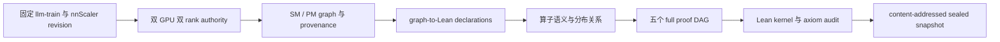
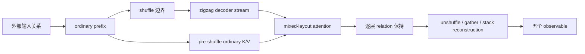

# TrainVerify：YOCO-MoE-A0.4B 分布式图的形式化验证

## 摘要

分布式训练系统会把一张单设备计算图改写成多张设备局部图，并插入分片、复制、通信和布局变换。下文把单设备参考图简称为 SM graph，把分布式图简称为 PM graph。程序能够运行、张量形状一致，甚至少量数值测试通过，都不能说明改写前后计算的是同一个值。两个形状同为 `[2048, 1024]` 的张量，可能分别表示连续序列分片、zigzag 序列分片、复制副本或不同专家的局部结果。

TrainVerify 把这类正确性问题写成 Lean 定理。对固定版本的 YOCO-MoE-A0.4B、llm-train 和 nnScaler，我们从真实双 GPU 运行中取得 SM 与 PM 图，给图中的算子与通信建立张量语义，再证明五个观测量满足预期的跨设备值关系。最终公开定理从各自的外部输入出发，覆盖所有会影响目标值的上游节点。它们不是只验证一段局部后缀，也不把序列重排假设成恒等操作。

这项结果有明确边界。它证明的是五个固定图观测量在项目张量语义下的关系，不是 CUDA kernel 的 bitwise 等价，也不是完整训练收敛或模型质量定理。

本文保留少量与实现对应的术语。rank 是一次分布式执行中的单个工作进程，本次实验有两个 rank，分别使用一张 GPU。NCCL 是两个进程实际执行 GPU 通信所用的运行库。zigzag 是 context parallelism 使用的首尾交错序列布局。evaluator 是 Lean 中解释图节点如何计算张量值的函数。完整上游依赖是所有会影响目标值的 producer 节点；局部 cut 则从某个中间张量开始，省略更早的 producer。authority 指固定源码版本、运行环境、规划配置和图文件后得到的来源证据。

## 1. 结果是什么

### 1.1 自然语言表述

固定本次发布使用的模型、三个项目的源码版本和分布规划配置。对于第 1.2 节表中的每个观测量，如果 SM 初始状态与两个 PM rank 的初始状态满足对应定理列出的输入条件，那么执行所有相关上游节点后，两个设备上的局部结果能够按该定理规定的方式重构为 SM 结果。

这句话包含三个不同层次，不能混为一谈。

| 层次 | 回答的问题 | 本次状态 |
|---|---|---|
| Lean 定理 | 在项目张量语义和输入条件下，五个值关系是否成立 | 5/5 已证明 |
| Authority 绑定 | 定理中的图是否来自固定版本的真实双 GPU planner | 已绑定 runF authority |
| Sealed 发布 | authority、证明源码、Lean 检查和逐文件清单是否闭合为同一工件 | 已发布，状态由 final receipt 给出 |

Lean 定理负责数学关系，authority 负责图的来源，sealed 发布负责两者是否绑定到同一组不可替换的字节。任何一层通过都不能代替另外两层。

### 1.2 五个公开定理

最终公开接口位于 `trainverify/denote/yoco_goals/Instances.lean`：

```lean
theorem prove_goal_1_from_pattern_1 : goal_1_stmt_full
theorem prove_goal_2_from_pattern_2 : goal_2_stmt_full
theorem prove_goal_3_from_pattern_3 : goal_3_stmt_full
theorem prove_goal_4_from_pattern_4 : goal_4_stmt_full
theorem prove_goal_5_from_pattern_5 : goal_5_stmt_full
```

`MainTheorem.lean` 将五项结果合并为 `FullPatternTier`。五个定理的含义如下。

| 目标 | 观测量 | 证明覆盖的主要路径 | 使用的图语义 |
|---|---|---|---|
| 1 | cross-entropy head 的第一个输出 | embedding、24 层 decoder、shuffle、mixed attention、unshuffle、RMSNorm、CE head | 忠实分布语义 `denoteGraphDistributedFaithful` |
| 2 | 同一 CE head 的第二个输出 | 与 Goal 1 共享 producer prefix，但独立证明自己的 loss tail | 忠实分布语义 `denoteGraphDistributedFaithful` |
| 3 | 24 层 routing-map stack | skip-unshuffle 路径、设备局部 stack、最终 gather | 忠实分布语义 `denoteGraphDistributedFaithful` |
| 4 | 24 层 expert-prob stack | scoped graph bridge、逐层 score relation、最终 gather | 忠实分布语义 `denoteGraphDistributedFaithful` |
| 5 | hidden-sharded embedding 的 AllToAll 输出 | 两个 hidden shard、双 rank AllToAll、完整小图 ancestry | 普通图语义 `denoteGraph` |

这里的 `full` 表示定理从真实外部输入开始闭合目标的完整依赖图。它与下面两类历史结果不同：

- `cut` 定理从中间张量开始，只证明局部后缀；
- `plain` 定理使用较弱的图语义，可能不表达真实的分布布局。

公开的 `prove_pattern_N` 名称只指向完整定理。旧结果保留独立命名，不能冒充最终闭包。

### 1.3 审计结论

最终发布链通过了以下门禁：

| 检查 | 结果 |
|---|---|
| 五个公开定理的字面类型 | 5/5 为 `goal_N_stmt_full` |
| 最终快照中的 Lean 源码直接编译 | 463/463 通过 |
| `#print axioms` | 无 `sorryAx`，无项目手写 axiom |
| 外部输入条件可满足性 | `FivePublicContractsJointWitness` 通过 |
| 证明源码注册表 | 455 个模块，路径集合完全闭合 |
| 快照文件清单 | 456 条逐文件 SHA-256 |
| emitter 测试 | 54/54 通过 |
| 完整 Python suite | 111/111 通过 |
| 独立发布审查 | PASS |

五个定理依赖 Lean 常规内核项 `propext`、`Classical.choice`、`Quot.sound`。有限命题使用 `native_decide` 生成证明，它额外信任 `Lean.ofReduceBool` 和 `Lean.trustCompiler`，因此编译器属于这部分 certificate 的可信计算基线。Python 生成器不属于证明核心。Lean 内核只检查 proof term 是否证明了给定声明，并不判断声明是否忠实于真实 GPU 图；这项忠实性由 authority、emitter digest 和 registry 共同约束。

## 2. 为什么 shape 检查不够

考虑 context parallelism。单设备图中的序列长度为 4096。分布式图的两个 rank 都可能持有形状为 `[2048, d]` 的张量，但它们的含义有多种可能：

1. rank 0 持有前 2048 行，rank 1 持有后 2048 行；
2. 两个 rank 按 zigzag 规则交错持有首尾区间；
3. 两个 rank 持有同一个复制值；
4. 两个 rank 分别持有不同 expert 或 hidden slice；
5. 通信次序错误，形状正确但行顺序已经错了。

因此，正确性规格不能只写“PM 张量的 shape 等于预期 shape”。它必须说明每个 rank-local 值如何重构成单设备图中的全局值。

YOCO 还包含一个容易误判的边界。K/V projection 发生在 `wrap_maybe_shuffle(h)` 之前，所以 cache 中的 K/V 仍是普通连续分片；shuffle 之后的 Q 和 decoder stream 才使用 zigzag 布局。如果只看后续 attention 的 shape，很容易把 K/V 也错误地标成 zigzag。TrainVerify 沿 producer ancestry 判断布局，而不是根据 tensor 名称或所在层猜测。

## 3. 形式化对象

### 3.1 Authority graph

证明不直接读取一段 PyTorch 源码并猜测执行图。它使用 nnScaler 在固定模型、固定 revision 和固定 planner profile 下生成的两张图：

- SM graph：未做分布式改写的参考图；
- PM graph：真实双 rank 规划后的分布式图。

每个节点记录算子、输入 tensor ID、输出 tensor ID、参数和设备信息。图与源码 revision、硬件信息、communication profile、computation profile 一起组成 authority。proof 只对这组固定来源的图负责。

最终 authority 固定以下 revisions：

```text
TrainVerify  63cabbff6888e3d51359dd2bf9f6d6ae75c2e98a
llm-train    9a1be1d5fd1c063d80be82797692cdc7d23cfbef
nnScaler     d3d468ed23edb2f28aa8566b2dfb6ed49c5955cf
```

真实双 GPU、双 rank NCCL runF 生成的图为：

```text
SM  SHA-256  333a14387e13cb265e74588f02133a0c47b02329d3d1811e6d7a736387494f64
SM  nodes     2074

PM  SHA-256  a47d033c83a0cd6dff9111ba49071f3a80eb60869435fc2adeb4f725a71c3462
PM  nodes     4363
```

CPU、单 GPU、模拟 collective 或仅设置 `plan_ngpus=2` 都不能替代这条 authority。

### 3.2 图的执行语义

Lean 中的图由有序节点构成。执行状态是从 tensor ID 到张量值的 store。每执行一个节点，evaluator 从 store 取出输入，计算输出，再写回相应 tensor ID。

普通 evaluator `denoteGraph` 适合不需要跨 rank ownership 信息的图。Goals 1 至 4 使用 `denoteGraphDistributedFaithful`。后者在执行 PM 节点时保留 rank、布局和通信语义，使证明能够区分“形状相同但 ownership 不同”的张量。

### 3.3 三类核心关系

证明主要使用三类 SM/PM 关系。

普通连续分片关系表示两个 rank 的局部张量沿指定维度拼接后等于 SM 张量。它用于普通 tensor parallel shard、shuffle 前的 K/V cache，以及若干 hidden shard。

Zigzag 关系表示两个 rank 按 context-parallel 首尾交错规则持有 SM 序列。它用于 shuffle 后的 decoder stream、Q 分支和相应 attention 输出。普通拼接与 zigzag 重构不是同一个关系，不能互换。

复制与 buddy 关系表示 rank 间复制值、expert-local 值或 replica-buddy 元数据之间的对应方式。MoE router、expert 计算和后续 collective 依赖这些关系。

这些关系不是附在 tensor 上的说明文字。每个 relation 都进入 theorem 的前提、局部 lemma 或组合证明。

## 4. 从训练代码到 Lean theorem

完整链路分五步。



### 4.1 生成并认证 authority

`generate_authority.sh` 在隔离环境中运行 planner。运行时、native solver、communication profile 和 computation profile 都有独立 digest。authority 通过 no-replace rename 发布，旧结果不能被同名覆盖。

这一步回答的是“我们证明的图从哪里来”。它本身还不是数学证明。

### 4.2 把图翻译成 Lean 声明

`graph_to_lean` 将 SM/PM 节点、tensor metadata、目标 observable 和 backward ancestry 写成 Lean declaration。每个 goal 只保留影响目标的 producer closure，但不能随意删除难证的节点。

图翻译后会产生两层文件：

- raw emission：由 authority fresh 生成的 graph 和 goal statement；
- authenticated overlays：checked-in caller contracts、helper lemmas 和最终 proof modules。

proof registry 分别绑定两层字节。这样既能证明 statement 来自指定 authority，又不会把手写 proof 假装成 generator 输出。

### 4.3 证明局部关系

每种算子需要一个与其语义一致的 relation lemma。例如，普通 elementwise 算子通常保持当前 shard relation；collective 会改变重构方式；shuffle 将普通序列布局变为 zigzag；unshuffle 做相反转换。

关键顺序是先核对 Python/nnScaler 的算子语义，再写 Lean commute lemma。如果 Denote 层与上游实现不一致，下游 theorem 即使全绿也没有意义。

### 4.4 沿 ancestry 组合

局部 lemma 按图的 producer 顺序组合。证明器维护 SM store 与各 PM rank store 之间已经建立的关系，并在每个节点后更新 relation environment。

SM 和 PM 的 goal graph 不一定整体定义相等。切片、过滤和 goal-specific ancestry 都可能产生差异。可接受的桥只有三类：

1. 可证明的 exact prefix equality；
2. 在目标 backward scope 内的 filtered equality；
3. 直接在目标 graph 上重新证明 producer relation。

不能因为两个图前几个节点相似，就把整个 graph 写成 `rfl`。也不能把 Graph A 上的 relation 无桥地搬到 Graph B。

### 4.5 发布公开定理

五个 goal theorem 在 `Instances.lean` 统一导出，再由 `MainTheorem.lean` 组合。发布检查从空的 Lean build tree 出发，直接编译最终快照中的每一个 Lean source，最多并行四个 Lean 进程。

这种全源码检查防止两个问题：一是旧 `.olean` 让 importer 读到过期定理；二是孤立 Lean 文件进入最终快照，却从未被本次编译检查。文件权限、输出 digest 和发布时的描述符检查记录在工程审计附录中。

## 5. 五个证明如何组织

五项证明共享同一条基本路线。证明先从外部输入关系出发，沿 producer 顺序建立 SM store 与两个 PM rank store 的关系。遇到布局或通信边界时，relation 随真实算子改变；到达目标节点后，再用 unshuffle、gather 或 stack reconstruction 得到最终观测量。



Goals 1 和 2 共享最长的 producer prefix，但各自证明不同的 loss tail。Goals 3 和 4 复用部分层级事实，不过只在各自 observable 的 backward scope 内建立 graph bridge。Goal 5 使用一张独立的小图，直接闭合 hidden sharding 与 AllToAll。`FivePublicContractsJointWitness` 位于输入端，用具体初始状态证明五组外部条件都可满足；它不参与 graph 执行，也不能替代任何中间 relation。

### 5.1 Goal 1：完整 loss 路径

Goal 1 是最长的证明链。它从外部 token 和按 hidden 维分片的 embedding 开始，先处理 L0 至 L11 的普通布局，再跨过 L12 的真实 shuffle 边界。L12 至 L23 的 decoder stream 使用 zigzag 关系，但 shuffle 前生成的 K/V cache 继续使用普通连续分片。证明随后覆盖混合布局的 attention、最终 unshuffle、RMSNorm 和 cross-entropy head。

这条证明的难点不是某个单独算子，而是同一层中同时存在普通布局的 K/V 与 zigzag 布局的 Q 和 decoder stream。布局判断必须跟随产生该张量的上游节点。

### 5.2 Goal 2：共享前缀，独立 loss tail

Goal 2 与 Goal 1 共享大部分上游计算，但目标输出不同。证明复用已经建立的共享前缀关系，再单独闭合 Goal 2 的 unshuffle 和 loss tail。它不是 `Goal 1 已证` 的别名。

### 5.3 Goal 3：routing-map stack

Goal 3 观察 24 层 routing map，不经过 loss head 的最终 unshuffle。证明只在该观测量的上游依赖范围内过滤无关节点，然后分别建立 SM stack、两个 PM rank 的局部 stack 和最终 `AllGatherPrim dim=1` 的关系。

### 5.4 Goal 4：expert-prob stack

Goal 4 观察 24 层 expert probability。它与 Goals 1、3 有共享结构，但不能把几张图整体视为相等。证明先在前半段的目标依赖范围内建立图间桥接，再逐层证明 attention、norm、router、output 和 score。长链按真实语义边界拆成小模块，在有限 heartbeat 下分别检查。

### 5.5 Goal 5：hidden shard 与 AllToAll

Goal 5 的图较小，包含一个 SM embedding、两个 PM hidden-sharded embedding 和双 rank AllToAll。它使用普通 `denoteGraph`，但证明覆盖完整 ancestry，不依赖外部提供中间计算值。这个案例也是 proof compiler 最接近端到端自动闭合的一条路径。

## 6. 防止“证明了错误命题”

形式化项目最危险的失败不是编译报错，而是编译通过却证明了被弱化、被切断或前提不可满足的命题。YOCO 发布流程对此设置了四道门。

第一，公开 theorem 的类型必须字面等于 `goal_N_stmt_full`。局部 cut、旧 evaluator 下的命题和兼容性别名都不能占用公开名字。

第二，外部输入条件只能描述执行前就能检查的良构性，例如 label 范围或初始分片关系。它不能引用图执行后才得到的张量。`FivePublicContractsJointWitness` 为五组条件给出具体可满足性见证，排除通过不可能前提证明任意结论的情况。

第三，`#print axioms` 对五个公开 theorem 逐项检查。发布流程拒绝 `sorry`、`sorryAx`、新增手写 axiom、`False.elim`、unsafe shortcut 和不可能前提。

第四，proof registry 固定精确路径和逐文件 digest。缺失模块、额外模块、重复路径、未知字段、源码 hash 变化或禁用标记都会使发布失败。

历史生成器曾产生 `Goal_N_CutToFull.lean`，试图用 `rfl` 声称局部命题与完整命题定义相等。最终 proof overlay 改变命题后，这个等式不再成立。发布流程没有伪造一条桥接定理来保住旧文件，而是从最终快照中移除这些失效 certificate 及其仅有的聚合消费者。五个公开 full theorem 直接证明各自的完整命题，因此不依赖这些文件。

## 7. 信任边界

这项工作包含多种证据，不能统称为“已经验证”。

| 层 | 证据 | 能说明什么 |
|---|---|---|
| 真实 GPU authority | 双 GPU、双 rank NCCL 输出及来源记录 | SM/PM 图来自固定运行环境 |
| Python emitter | 可复现的 Lean 源码与 manifest | 生成器按规则写出了候选声明 |
| Lean 内核与编译器 | theorem elaboration、`native_decide` 与 axiom audit | proof term 在声明的语义和公开信任基线下成立 |
| proof registry | 精确路径与源码 digest | 编译和发布的是被审核的那组源码 |
| sealed publication | 内容地址与逐文件清单 | 最终目录与已验证字节一致，且没有覆盖旧结果 |

Python emitter、coverage script 和外部 checker 都不是 Lean theorem 的信任核心。反过来，Lean theorem 也不能证明 authority 文件确实来自真实双 GPU 运行。最终结论要求这些证据绑定同一个源码 revision。

## 8. 最终发布

权威发布 receipt 位于：

```text
$HOME/yoco-final-publication/receipts/yoco-a04b-final-sealed.json
```

当前 receipt 将 TrainVerify revision `63cabbff6888e3d51359dd2bf9f6d6ae75c2e98a` 与 runF authority、455-module proof registry、463-module Lean 检查和最终 sealed manifest 绑定在一起。最终快照包含 456 条逐文件 digest；其 manifest SHA-256 为 `e54a53a32a316ea98e8ee60376ae477f51eebb823355bdb3632de414f1da832d`。

发布器根据 fresh manifest 自动生成内容地址，并拒绝覆盖已有目录。逐文件权限、描述符复核、原子 rename 实现和历史候选目录均记录在 [`TRAINVERIFY_YOCO_FORMALIZATION_AUDIT.md`](TRAINVERIFY_YOCO_FORMALIZATION_AUDIT.md)，不在这里展开。

## 9. 如何复核

### 9.1 Python tests

在仓库根目录运行：

```bash
uv run --with pytest --python 3.11 \
  python -m pytest -q scripts/tests/test_yoco_regen_driver.py

uv run --with pytest --python 3.11 \
  python -m pytest -q Verdict/tests scripts/tests trainverify/tests
```

最终结果分别为 `54 passed` 和 `111 passed`。这些测试检查 emitter、registry、ledger 和其他 Python 逻辑，不替代 Lean 内核检查。

### 9.2 正式 sealed emission

正式发布需要 owner-only TrainVerify materialization、固定 upstream repositories、真实 authority 和 trusted Lean package cache：

```bash
TRAINVERIFY_PRIVATE_MATERIALIZATION=/private/trainverify \
python -m scripts.yoco_regen.emit_yoco_a04b \
  --authority-dir /authority/run \
  --llm-train /pinned/llm-train \
  --nnscaler /pinned/nnscaler \
  --expected-hardware-sha256 <out-of-band-digest> \
  --lean-project /trusted/lean-project-with-lake-packages \
  --snapshot-dir /sealed-parent/staging-placeholder \
  --content-addressed \
  --trust-new-authority
```

`--snapshot-dir` 在这个模式下只提供父目录和 staging 占位名。最终目录名由 fresh manifest digest 生成，调用者不能预填 content address。

Authority 的生成、传输检查和隔离环境要求见 `scripts/yoco_regen/README.md`。完整工程审计记录见 [`TRAINVERIFY_YOCO_FORMALIZATION_AUDIT.md`](TRAINVERIFY_YOCO_FORMALIZATION_AUDIT.md)。

## 10. 这项结果没有证明什么

第一，它没有证明 CUDA kernel 的逐位等价。Lean 中使用的是项目定义的张量语义。若要得到逐位等价定理，还需要形式化浮点运算、kernel 实现和编译器 lowering。

第二，它没有证明完整训练收敛、最终模型质量或所有 optimizer state 一致。五个 theorem 只覆盖固定图中的五个观测量。

第三，它还不是适用于任意网络的一键 proof compiler。当前证明仍包含 YOCO-specific 节点归约 certificate、按层组织的模块和手写 scoped graph bridge。自动化已经能够生成并检查部分 proof DAG，但还不能对任意新模型独立完成 ownership inference、bridge synthesis 和反例提取。

第四，历史发现不自动适用于新 revision。图节点、TID、planner 路径或上游实现变化后，必须重新生成 authority 并重新证明，不能修改旧 metadata 来继承结论。

## 11. 源码索引

### Authority 与 emission

- `scripts/yoco_regen/generate_authority.sh`
- `scripts/yoco_regen/emit_yoco_a04b.py`
- `scripts/yoco_regen/yoco_proof_registry.json`
- `scripts/yoco_regen/README.md`
- `docs/YOCO_PROOF_REGISTRY.md`

### 形式语义

- `trainverify/denote/DenoteDistributedFaithful.lean`
- `trainverify/denote/ZigzagCollective.lean`
- `trainverify/denote/yoco_goals/ZigzagAttentionRel.lean`
- `trainverify/denote/EmbeddingHiddenShard.lean`

### 五个公开证明

- `trainverify/denote/yoco_goals/Goal1PublicFaithful.lean`
- `trainverify/denote/yoco_goals/Pattern_2.lean`
- `trainverify/denote/yoco_goals/Goal3PublicFaithful.lean`
- `trainverify/denote/yoco_goals/Goal4PublicFaithful.lean`
- `trainverify/denote/yoco_goals/Pattern_5.lean`
- `trainverify/denote/yoco_goals/Instances.lean`
- `trainverify/denote/yoco_goals/MainTheorem.lean`
- `trainverify/denote/yoco_goals/FivePublicContractsJointWitness.lean`

### 调查和审计记录

- `docs/TRAINVERIFY_YOCO_FORMALIZATION_AUDIT.md`
- `trainverify/GOAL_3_4_LAYOUT_SPLIT.md`
- `trainverify/UPSTREAM_NNSCALER_RVD_ZIGZAG.md`
- `trainverify/scripts/repro_nnscaler_zigzag_allgather.py`
- `docs/PROOF_COMPILER_REQUIREMENTS.md`

## 12. 一句话总结

对固定版本的 YOCO-MoE-A0.4B，TrainVerify 已将真实双 GPU planner 产生的五个分布式图观测量闭合为 Lean 可检查的完整定理。证明显式区分连续分片、zigzag、复制和 hidden-sharded 值关系，并通过精确源码注册表、全源码 Lean 检查、axiom audit 和内容寻址发布，把图来源、证明源码与最终工件绑定在同一条来源链上。
